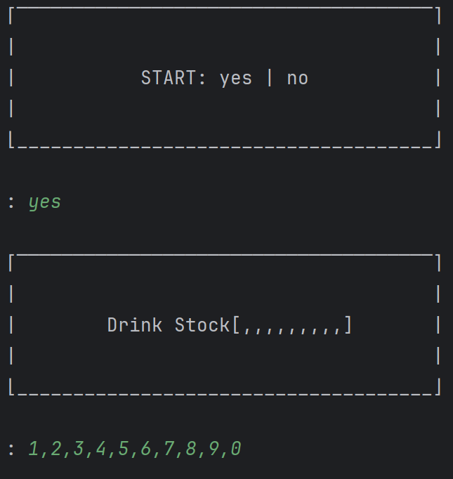
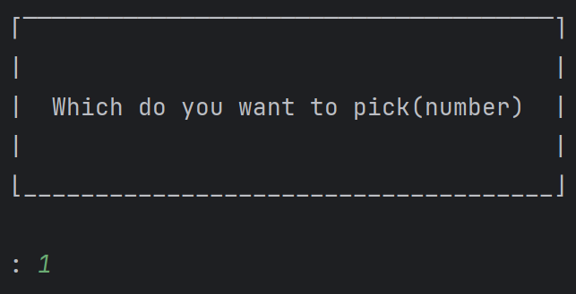
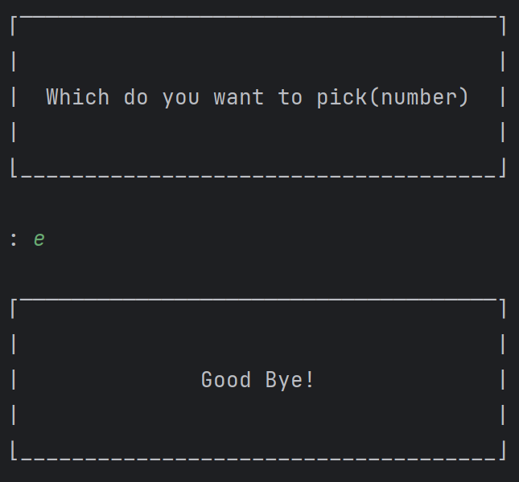

☕ Virtual Vending Machine(JAVA)
===

This is a console-based virtual vending machine program implemented in Java.

The entire interface is visually represented in the console environment using text and symbols.
Users can set the initial drink stock, select their desired beverage, and check the inventory status in real-time.

- - -

🚀 Features
---

- **Start Confirmation**: Confirms whether to start the program upon launch.
- **Stock Configuration**: Allows you to set the initial stock for each drink after starting.
- **Visual Interface**: The vending machine's appearance and drink status are clearly displayed in the console (Optimized for the IntelliJ IDEA console).
- **Beverage Selection**: You can select a drink by choosing its corresponding number (1-10).
- **Dispensing Animation**: When a drink is selected, an animation showing the dispensed item is displayed for 2 seconds before returning to the main screen.
- **Inventory Management**: When a drink is out of stock, XX is displayed below the item to indicate it is unavailable.
- **Exit Program**: You can terminate the program by entering e.

- - -

🎈 User Scenario
---



⬜⬜⬜⬜⬜⬜⬜⬜⬜⬜⬜⬜⬜⬜⬜⬜⬜⬜⬜⬜⬜⬜<br>
⬜⬛⬛⬛⬛⬛⬛⬛⬛⬛⬛⬛⬛⬛⬛⬛⬛⬛⬛⬛⬛⬜<br>
⬜⬛🔷🔷⬛⬛🔷🔷⬛⬛🔷🔷⬛⬛🔷🔷⬛⬛🔷🔷⬛⬜<br>
⬜⬛🔷🔷⬛⬛🔷🔷⬛⬛🔷🔷⬛⬛🔷🔷⬛⬛🔷🔷⬛⬜<br>
⬜⬛🔷🔷⬛⬛🔷🔷⬛⬛🔷🔷⬛⬛🔷🔷⬛⬛🔷🔷⬛⬜<br>
⬜⬛⬛⬛⬛⬛⬛⬛⬛⬛⬛⬛⬛⬛⬛⬛⬛⬛⬛⬛⬛⬜<br>
⬜⬛🔶🔶⬛⬛🔶🔶⬛⬛🔶🔶⬛⬛🔶🔶⬛⬛🔶🔶⬛⬜<br>
⬜⬛⬛⬛⬛⬛⬛⬛⬛⬛⬛⬛⬛⬛⬛⬛⬛⬛⬛⬛⬛⬜<br>
⬜⬛🔷🔷⬛⬛🔷🔷⬛⬛🔷🔷⬛⬛🔷🔷⬛⬛🔷🔷⬛⬜<br>
⬜⬛🔷🔷⬛⬛🔷🔷⬛⬛🔷🔷⬛⬛🔷🔷⬛⬛🔷🔷⬛⬜<br>
⬜⬛🔷🔷⬛⬛🔷🔷⬛⬛🔷🔷⬛⬛🔷🔷⬛⬛🔷🔷⬛⬜<br>
⬜⬛⬛⬛⬛⬛⬛⬛⬛⬛⬛⬛⬛⬛⬛⬛⬛⬛⬛⬛⬛⬜<br>
⬜⬛🔶🔶⬛⬛🔶🔶⬛⬛🔶🔶⬛⬛🔶🔶⬛⬛❌❌⬛⬜<br>
⬜⬛⬛⬛⬛⬛⬛⬛⬛⬛⬛⬛⬛⬛⬛⬛⬛⬛⬛⬛⬛⬜<br>
⬜⬜⬜⬜⬜⬜⬜⬜⬜⬜⬜⬜⬜⬜⬜⬜⬜⬜⬜⬜⬜⬜<br>
⬜⬜🍎🍎🍠🍠🦺🦺🍤🍤🧀🧀🍐🍐⬜⬜⬜◼️◼️◼️⬜⬜<br>
⬜⬜🍎🍎🍠🍠🦺🦺🍤🍤🧀🧀🍐🍐⬜⬜⬜◼️◼️◼️⬜⬜<br>
⬜⬜🍎🍎🍠🍠🦺🦺🍤🍤🧀🧀🍐🍐⬜⬜⬜⬜⬜⬜⬜⬜<br>
⬜⬜🍎🍎🍠🍠🦺🦺🍤🍤🧀🧀🍐🍐⬜⬜⬜⬜⬜⬜⬜⬜<br>
⬜⬜⬜⬜⬜⬜⬜⬜⬜⬜⬜⬜⬜⬜⬜⬜⬜⬜⬜⬜⬜⬜<br>
⬜⬜◼️◼️◼️◼️◼️◼️◼️◼️◼️◼️◼️◼️◼️◼️◼️◼️◼️◼️⬜⬜<br>
⬜⬜◼️◼️◼️◼️◼️◼️◼️◼️◼️◼️◼️◼️◼️◼️◼️◼️◼️◼️⬜⬜<br>
⬜⬜◼️◼️◼️◼️◼️◼️◼️◼️◼️◼️◼️◼️◼️◼️◼️◼️◼️◼️⬜⬜<br>
⬜⬜⬜⬜⬜⬜⬜⬜⬜⬜⬜⬜⬜⬜⬜⬜⬜⬜⬜⬜⬜⬜<br>
⬜⬜⬜⬜⬜⬜⬜⬜⬜⬜⬜⬜⬜⬜⬜⬜⬜⬜⬜⬜⬜⬜<br>



⬜⬜⬜⬜⬜⬜⬜⬜⬜⬜⬜⬜⬜⬜⬜⬜⬜⬜⬜⬜⬜⬜<br>
⬜⬛⬛⬛⬛⬛⬛⬛⬛⬛⬛⬛⬛⬛⬛⬛⬛⬛⬛⬛⬛⬜<br>
⬜⬛🔷🔷⬛⬛🔷🔷⬛⬛🔷🔷⬛⬛🔷🔷⬛⬛🔷🔷⬛⬜<br>
⬜⬛🔷🔷⬛⬛🔷🔷⬛⬛🔷🔷⬛⬛🔷🔷⬛⬛🔷🔷⬛⬜<br>
⬜⬛🔷🔷⬛⬛🔷🔷⬛⬛🔷🔷⬛⬛🔷🔷⬛⬛🔷🔷⬛⬜<br>
⬜⬛⬛⬛⬛⬛⬛⬛⬛⬛⬛⬛⬛⬛⬛⬛⬛⬛⬛⬛⬛⬜<br>
⬜⬛❌❌⬛⬛🔶🔶⬛⬛🔶🔶⬛⬛🔶🔶⬛⬛🔶🔶⬛⬜<br>
⬜⬛⬛⬛⬛⬛⬛⬛⬛⬛⬛⬛⬛⬛⬛⬛⬛⬛⬛⬛⬛⬜<br>
⬜⬛🔷🔷⬛⬛🔷🔷⬛⬛🔷🔷⬛⬛🔷🔷⬛⬛🔷🔷⬛⬜<br>
⬜⬛🔷🔷⬛⬛🔷🔷⬛⬛🔷🔷⬛⬛🔷🔷⬛⬛🔷🔷⬛⬜<br>
⬜⬛🔷🔷⬛⬛🔷🔷⬛⬛🔷🔷⬛⬛🔷🔷⬛⬛🔷🔷⬛⬜<br>
⬜⬛⬛⬛⬛⬛⬛⬛⬛⬛⬛⬛⬛⬛⬛⬛⬛⬛⬛⬛⬛⬜<br>
⬜⬛🔶🔶⬛⬛🔶🔶⬛⬛🔶🔶⬛⬛🔶🔶⬛⬛❌❌⬛⬜<br>
⬜⬛⬛⬛⬛⬛⬛⬛⬛⬛⬛⬛⬛⬛⬛⬛⬛⬛⬛⬛⬛⬜<br>
⬜⬜⬜⬜⬜⬜⬜⬜⬜⬜⬜⬜⬜⬜⬜⬜⬜⬜⬜⬜⬜⬜<br>
⬜⬜🍎🍎🍠🍠🦺🦺🍤🍤🧀🧀🍐🍐⬜⬜⬜◼️◼️◼️⬜⬜<br>
⬜⬜🍎🍎🍠🍠🦺🦺🍤🍤🧀🧀🍐🍐⬜⬜⬜◼️◼️◼️⬜⬜<br>
⬜⬜🍎🍎🍠🍠🦺🦺🍤🍤🧀🧀🍐🍐⬜⬜⬜⬜⬜⬜⬜⬜<br>
⬜⬜🍎🍎🍠🍠🦺🦺🍤🍤🧀🧀🍐🍐⬜⬜⬜⬜⬜⬜⬜⬜<br>
⬜⬜⬜⬜⬜⬜⬜⬜⬜⬜⬜⬜⬜⬜⬜⬜⬜⬜⬜⬜⬜⬜<br>
⬜⬜◼️◼️◼️◼️◼️◼️◼️◼️◼️◼️◼️◼️◼️◼️◼️◼️◼️◼️⬜⬜<br>
⬜⬜◼️◼️◼️◼️◼️◼️◼️🔷🔷🔷◼️◼️◼️◼️◼️◼️◼️◼️⬜⬜<br>
⬜⬜◼️◼️◼️◼️◼️◼️◼️🔷🔷🔷◼️◼️◼️◼️◼️◼️◼️◼️⬜⬜<br>
⬜⬜⬜⬜⬜⬜⬜⬜⬜⬜⬜⬜⬜⬜⬜⬜⬜⬜⬜⬜⬜⬜<br>
⬜⬜⬜⬜⬜⬜⬜⬜⬜⬜⬜⬜⬜⬜⬜⬜⬜⬜⬜⬜⬜⬜<br>

⬜⬜⬜⬜⬜⬜⬜⬜⬜⬜⬜⬜⬜⬜⬜⬜⬜⬜⬜⬜⬜⬜<br>
⬜⬛⬛⬛⬛⬛⬛⬛⬛⬛⬛⬛⬛⬛⬛⬛⬛⬛⬛⬛⬛⬜<br>
⬜⬛🔷🔷⬛⬛🔷🔷⬛⬛🔷🔷⬛⬛🔷🔷⬛⬛🔷🔷⬛⬜<br>
⬜⬛🔷🔷⬛⬛🔷🔷⬛⬛🔷🔷⬛⬛🔷🔷⬛⬛🔷🔷⬛⬜<br>
⬜⬛🔷🔷⬛⬛🔷🔷⬛⬛🔷🔷⬛⬛🔷🔷⬛⬛🔷🔷⬛⬜<br>
⬜⬛⬛⬛⬛⬛⬛⬛⬛⬛⬛⬛⬛⬛⬛⬛⬛⬛⬛⬛⬛⬜<br>
⬜⬛🔶🔶⬛⬛🔶🔶⬛⬛🔶🔶⬛⬛🔶🔶⬛⬛🔶🔶⬛⬜<br>
⬜⬛⬛⬛⬛⬛⬛⬛⬛⬛⬛⬛⬛⬛⬛⬛⬛⬛⬛⬛⬛⬜<br>
⬜⬛🔷🔷⬛⬛🔷🔷⬛⬛🔷🔷⬛⬛🔷🔷⬛⬛🔷🔷⬛⬜<br>
⬜⬛🔷🔷⬛⬛🔷🔷⬛⬛🔷🔷⬛⬛🔷🔷⬛⬛🔷🔷⬛⬜<br>
⬜⬛🔷🔷⬛⬛🔷🔷⬛⬛🔷🔷⬛⬛🔷🔷⬛⬛🔷🔷⬛⬜<br>
⬜⬛⬛⬛⬛⬛⬛⬛⬛⬛⬛⬛⬛⬛⬛⬛⬛⬛⬛⬛⬛⬜<br>
⬜⬛🔶🔶⬛⬛🔶🔶⬛⬛🔶🔶⬛⬛🔶🔶⬛⬛❌❌⬛⬜<br>
⬜⬛⬛⬛⬛⬛⬛⬛⬛⬛⬛⬛⬛⬛⬛⬛⬛⬛⬛⬛⬛⬜<br>
⬜⬜⬜⬜⬜⬜⬜⬜⬜⬜⬜⬜⬜⬜⬜⬜⬜⬜⬜⬜⬜⬜<br>
⬜⬜🍎🍎🍠🍠🦺🦺🍤🍤🧀🧀🍐🍐⬜⬜⬜◼️◼️◼️⬜⬜<br>
⬜⬜🍎🍎🍠🍠🦺🦺🍤🍤🧀🧀🍐🍐⬜⬜⬜◼️◼️◼️⬜⬜<br>
⬜⬜🍎🍎🍠🍠🦺🦺🍤🍤🧀🧀🍐🍐⬜⬜⬜⬜⬜⬜⬜⬜<br>
⬜⬜🍎🍎🍠🍠🦺🦺🍤🍤🧀🧀🍐🍐⬜⬜⬜⬜⬜⬜⬜⬜<br>
⬜⬜⬜⬜⬜⬜⬜⬜⬜⬜⬜⬜⬜⬜⬜⬜⬜⬜⬜⬜⬜⬜<br>
⬜⬜◼️◼️◼️◼️◼️◼️◼️◼️◼️◼️◼️◼️◼️◼️◼️◼️◼️◼️⬜⬜<br>
⬜⬜◼️◼️◼️◼️◼️◼️◼️◼️◼️◼️◼️◼️◼️◼️◼️◼️◼️◼️⬜⬜<br>
⬜⬜◼️◼️◼️◼️◼️◼️◼️◼️◼️◼️◼️◼️◼️◼️◼️◼️◼️◼️⬜⬜<br>
⬜⬜⬜⬜⬜⬜⬜⬜⬜⬜⬜⬜⬜⬜⬜⬜⬜⬜⬜⬜⬜⬜<br>
⬜⬜⬜⬜⬜⬜⬜⬜⬜⬜⬜⬜⬜⬜⬜⬜⬜⬜⬜⬜⬜⬜<br>



- - -

💻 How to Run (IntelliJ IDEA)
---

1. Clone the repository to your local machine, either via the command line or using IntelliJ IDEA's built-in Git support.
```
git clone https://github.com/limjs245/VendingMachine_java.git
```
2. Open the cloned project directory in IntelliJ IDEA.
3. Locate the main method within the project source files and run it.
4. Once the program starts in the Run tab, follow the on-screen prompts to set the initial stock and select your drinks.

- - -

🛠️ Tech Stack
---

- JAVA

- - -
- - -

☕ 가상 자판기(자바)
===

이 프로젝트는 자바(Java)로 구현한 콘솔 기반의 가상 자판기 프로그램입니다.

모든 인터페이스는 텍스트와 기호를 통해 콘솔 환경에서 시각적으로 표현됩니다.
사용자는 초기 음료 재고를 설정하고, 원하는 음료를 선택하며, 실시간으로 재고 상태를 확인할 수 있습니다.

- - -

🚀 주요 기능
---

- **시작 여부 확인**: 초기 시작 시 Start 여부 확인
- **재고 설정**: 시작 후 자판기 음료 재고 설정 가능
- **시각적 인터페이스**: 자판기의 외형과 음료수 현황이 콘솔에 보기 쉽게 출력(IntelliJ 기준)
- **음료 선택 가능**: 원하는 음료 번호를 선택 가능(1~10)
- **배출 애니메이션**: 음료 선택 시 음료가 나온 이미지가 2초간 뜨고 다시 원 이미지로 돌아옴
- **재고 관리**: 음료 재고가 떨어질 시 음료 밑 디스플레이가 xx로 뜸
- **종료**: e를 입력 시 종료

- - -

🎈 사용자 시나리오
---


⬜⬜⬜⬜⬜⬜⬜⬜⬜⬜⬜⬜⬜⬜⬜⬜⬜⬜⬜⬜⬜⬜<br>
⬜⬛⬛⬛⬛⬛⬛⬛⬛⬛⬛⬛⬛⬛⬛⬛⬛⬛⬛⬛⬛⬜<br>
⬜⬛🔷🔷⬛⬛🔷🔷⬛⬛🔷🔷⬛⬛🔷🔷⬛⬛🔷🔷⬛⬜<br>
⬜⬛🔷🔷⬛⬛🔷🔷⬛⬛🔷🔷⬛⬛🔷🔷⬛⬛🔷🔷⬛⬜<br>
⬜⬛🔷🔷⬛⬛🔷🔷⬛⬛🔷🔷⬛⬛🔷🔷⬛⬛🔷🔷⬛⬜<br>
⬜⬛⬛⬛⬛⬛⬛⬛⬛⬛⬛⬛⬛⬛⬛⬛⬛⬛⬛⬛⬛⬜<br>
⬜⬛🔶🔶⬛⬛🔶🔶⬛⬛🔶🔶⬛⬛🔶🔶⬛⬛🔶🔶⬛⬜<br>
⬜⬛⬛⬛⬛⬛⬛⬛⬛⬛⬛⬛⬛⬛⬛⬛⬛⬛⬛⬛⬛⬜<br>
⬜⬛🔷🔷⬛⬛🔷🔷⬛⬛🔷🔷⬛⬛🔷🔷⬛⬛🔷🔷⬛⬜<br>
⬜⬛🔷🔷⬛⬛🔷🔷⬛⬛🔷🔷⬛⬛🔷🔷⬛⬛🔷🔷⬛⬜<br>
⬜⬛🔷🔷⬛⬛🔷🔷⬛⬛🔷🔷⬛⬛🔷🔷⬛⬛🔷🔷⬛⬜<br>
⬜⬛⬛⬛⬛⬛⬛⬛⬛⬛⬛⬛⬛⬛⬛⬛⬛⬛⬛⬛⬛⬜<br>
⬜⬛🔶🔶⬛⬛🔶🔶⬛⬛🔶🔶⬛⬛🔶🔶⬛⬛❌❌⬛⬜<br>
⬜⬛⬛⬛⬛⬛⬛⬛⬛⬛⬛⬛⬛⬛⬛⬛⬛⬛⬛⬛⬛⬜<br>
⬜⬜⬜⬜⬜⬜⬜⬜⬜⬜⬜⬜⬜⬜⬜⬜⬜⬜⬜⬜⬜⬜<br>
⬜⬜🍎🍎🍠🍠🦺🦺🍤🍤🧀🧀🍐🍐⬜⬜⬜◼️◼️◼️⬜⬜<br>
⬜⬜🍎🍎🍠🍠🦺🦺🍤🍤🧀🧀🍐🍐⬜⬜⬜◼️◼️◼️⬜⬜<br>
⬜⬜🍎🍎🍠🍠🦺🦺🍤🍤🧀🧀🍐🍐⬜⬜⬜⬜⬜⬜⬜⬜<br>
⬜⬜🍎🍎🍠🍠🦺🦺🍤🍤🧀🧀🍐🍐⬜⬜⬜⬜⬜⬜⬜⬜<br>
⬜⬜⬜⬜⬜⬜⬜⬜⬜⬜⬜⬜⬜⬜⬜⬜⬜⬜⬜⬜⬜⬜<br>
⬜⬜◼️◼️◼️◼️◼️◼️◼️◼️◼️◼️◼️◼️◼️◼️◼️◼️◼️◼️⬜⬜<br>
⬜⬜◼️◼️◼️◼️◼️◼️◼️◼️◼️◼️◼️◼️◼️◼️◼️◼️◼️◼️⬜⬜<br>
⬜⬜◼️◼️◼️◼️◼️◼️◼️◼️◼️◼️◼️◼️◼️◼️◼️◼️◼️◼️⬜⬜<br>
⬜⬜⬜⬜⬜⬜⬜⬜⬜⬜⬜⬜⬜⬜⬜⬜⬜⬜⬜⬜⬜⬜<br>
⬜⬜⬜⬜⬜⬜⬜⬜⬜⬜⬜⬜⬜⬜⬜⬜⬜⬜⬜⬜⬜⬜<br>


⬜⬜⬜⬜⬜⬜⬜⬜⬜⬜⬜⬜⬜⬜⬜⬜⬜⬜⬜⬜⬜⬜<br>
⬜⬛⬛⬛⬛⬛⬛⬛⬛⬛⬛⬛⬛⬛⬛⬛⬛⬛⬛⬛⬛⬜<br>
⬜⬛🔷🔷⬛⬛🔷🔷⬛⬛🔷🔷⬛⬛🔷🔷⬛⬛🔷🔷⬛⬜<br>
⬜⬛🔷🔷⬛⬛🔷🔷⬛⬛🔷🔷⬛⬛🔷🔷⬛⬛🔷🔷⬛⬜<br>
⬜⬛🔷🔷⬛⬛🔷🔷⬛⬛🔷🔷⬛⬛🔷🔷⬛⬛🔷🔷⬛⬜<br>
⬜⬛⬛⬛⬛⬛⬛⬛⬛⬛⬛⬛⬛⬛⬛⬛⬛⬛⬛⬛⬛⬜<br>
⬜⬛❌❌⬛⬛🔶🔶⬛⬛🔶🔶⬛⬛🔶🔶⬛⬛🔶🔶⬛⬜<br>
⬜⬛⬛⬛⬛⬛⬛⬛⬛⬛⬛⬛⬛⬛⬛⬛⬛⬛⬛⬛⬛⬜<br>
⬜⬛🔷🔷⬛⬛🔷🔷⬛⬛🔷🔷⬛⬛🔷🔷⬛⬛🔷🔷⬛⬜<br>
⬜⬛🔷🔷⬛⬛🔷🔷⬛⬛🔷🔷⬛⬛🔷🔷⬛⬛🔷🔷⬛⬜<br>
⬜⬛🔷🔷⬛⬛🔷🔷⬛⬛🔷🔷⬛⬛🔷🔷⬛⬛🔷🔷⬛⬜<br>
⬜⬛⬛⬛⬛⬛⬛⬛⬛⬛⬛⬛⬛⬛⬛⬛⬛⬛⬛⬛⬛⬜<br>
⬜⬛🔶🔶⬛⬛🔶🔶⬛⬛🔶🔶⬛⬛🔶🔶⬛⬛❌❌⬛⬜<br>
⬜⬛⬛⬛⬛⬛⬛⬛⬛⬛⬛⬛⬛⬛⬛⬛⬛⬛⬛⬛⬛⬜<br>
⬜⬜⬜⬜⬜⬜⬜⬜⬜⬜⬜⬜⬜⬜⬜⬜⬜⬜⬜⬜⬜⬜<br>
⬜⬜🍎🍎🍠🍠🦺🦺🍤🍤🧀🧀🍐🍐⬜⬜⬜◼️◼️◼️⬜⬜<br>
⬜⬜🍎🍎🍠🍠🦺🦺🍤🍤🧀🧀🍐🍐⬜⬜⬜◼️◼️◼️⬜⬜<br>
⬜⬜🍎🍎🍠🍠🦺🦺🍤🍤🧀🧀🍐🍐⬜⬜⬜⬜⬜⬜⬜⬜<br>
⬜⬜🍎🍎🍠🍠🦺🦺🍤🍤🧀🧀🍐🍐⬜⬜⬜⬜⬜⬜⬜⬜<br>
⬜⬜⬜⬜⬜⬜⬜⬜⬜⬜⬜⬜⬜⬜⬜⬜⬜⬜⬜⬜⬜⬜<br>
⬜⬜◼️◼️◼️◼️◼️◼️◼️◼️◼️◼️◼️◼️◼️◼️◼️◼️◼️◼️⬜⬜<br>
⬜⬜◼️◼️◼️◼️◼️◼️◼️🔷🔷🔷◼️◼️◼️◼️◼️◼️◼️◼️⬜⬜<br>
⬜⬜◼️◼️◼️◼️◼️◼️◼️🔷🔷🔷◼️◼️◼️◼️◼️◼️◼️◼️⬜⬜<br>
⬜⬜⬜⬜⬜⬜⬜⬜⬜⬜⬜⬜⬜⬜⬜⬜⬜⬜⬜⬜⬜⬜<br>
⬜⬜⬜⬜⬜⬜⬜⬜⬜⬜⬜⬜⬜⬜⬜⬜⬜⬜⬜⬜⬜⬜<br>

⬜⬜⬜⬜⬜⬜⬜⬜⬜⬜⬜⬜⬜⬜⬜⬜⬜⬜⬜⬜⬜⬜<br>
⬜⬛⬛⬛⬛⬛⬛⬛⬛⬛⬛⬛⬛⬛⬛⬛⬛⬛⬛⬛⬛⬜<br>
⬜⬛🔷🔷⬛⬛🔷🔷⬛⬛🔷🔷⬛⬛🔷🔷⬛⬛🔷🔷⬛⬜<br>
⬜⬛🔷🔷⬛⬛🔷🔷⬛⬛🔷🔷⬛⬛🔷🔷⬛⬛🔷🔷⬛⬜<br>
⬜⬛🔷🔷⬛⬛🔷🔷⬛⬛🔷🔷⬛⬛🔷🔷⬛⬛🔷🔷⬛⬜<br>
⬜⬛⬛⬛⬛⬛⬛⬛⬛⬛⬛⬛⬛⬛⬛⬛⬛⬛⬛⬛⬛⬜<br>
⬜⬛🔶🔶⬛⬛🔶🔶⬛⬛🔶🔶⬛⬛🔶🔶⬛⬛🔶🔶⬛⬜<br>
⬜⬛⬛⬛⬛⬛⬛⬛⬛⬛⬛⬛⬛⬛⬛⬛⬛⬛⬛⬛⬛⬜<br>
⬜⬛🔷🔷⬛⬛🔷🔷⬛⬛🔷🔷⬛⬛🔷🔷⬛⬛🔷🔷⬛⬜<br>
⬜⬛🔷🔷⬛⬛🔷🔷⬛⬛🔷🔷⬛⬛🔷🔷⬛⬛🔷🔷⬛⬜<br>
⬜⬛🔷🔷⬛⬛🔷🔷⬛⬛🔷🔷⬛⬛🔷🔷⬛⬛🔷🔷⬛⬜<br>
⬜⬛⬛⬛⬛⬛⬛⬛⬛⬛⬛⬛⬛⬛⬛⬛⬛⬛⬛⬛⬛⬜<br>
⬜⬛🔶🔶⬛⬛🔶🔶⬛⬛🔶🔶⬛⬛🔶🔶⬛⬛❌❌⬛⬜<br>
⬜⬛⬛⬛⬛⬛⬛⬛⬛⬛⬛⬛⬛⬛⬛⬛⬛⬛⬛⬛⬛⬜<br>
⬜⬜⬜⬜⬜⬜⬜⬜⬜⬜⬜⬜⬜⬜⬜⬜⬜⬜⬜⬜⬜⬜<br>
⬜⬜🍎🍎🍠🍠🦺🦺🍤🍤🧀🧀🍐🍐⬜⬜⬜◼️◼️◼️⬜⬜<br>
⬜⬜🍎🍎🍠🍠🦺🦺🍤🍤🧀🧀🍐🍐⬜⬜⬜◼️◼️◼️⬜⬜<br>
⬜⬜🍎🍎🍠🍠🦺🦺🍤🍤🧀🧀🍐🍐⬜⬜⬜⬜⬜⬜⬜⬜<br>
⬜⬜🍎🍎🍠🍠🦺🦺🍤🍤🧀🧀🍐🍐⬜⬜⬜⬜⬜⬜⬜⬜<br>
⬜⬜⬜⬜⬜⬜⬜⬜⬜⬜⬜⬜⬜⬜⬜⬜⬜⬜⬜⬜⬜⬜<br>
⬜⬜◼️◼️◼️◼️◼️◼️◼️◼️◼️◼️◼️◼️◼️◼️◼️◼️◼️◼️⬜⬜<br>
⬜⬜◼️◼️◼️◼️◼️◼️◼️◼️◼️◼️◼️◼️◼️◼️◼️◼️◼️◼️⬜⬜<br>
⬜⬜◼️◼️◼️◼️◼️◼️◼️◼️◼️◼️◼️◼️◼️◼️◼️◼️◼️◼️⬜⬜<br>
⬜⬜⬜⬜⬜⬜⬜⬜⬜⬜⬜⬜⬜⬜⬜⬜⬜⬜⬜⬜⬜⬜<br>
⬜⬜⬜⬜⬜⬜⬜⬜⬜⬜⬜⬜⬜⬜⬜⬜⬜⬜⬜⬜⬜⬜<br>


- - -

💻 실행 방법(IntelliJ IDEA)
---

1. 프로젝트를 로컬 환경에 복제(clone)하거나 IntelliJ IDEA 를 이용해 복제합니다.
```
git clone https://github.com/limjs245/VendingMachine_java.git
```
2. IntelliJ IDEA 에서 프로젝트를 엽니다.
3. main 메소드를 찾아 실행합니다.
4. 하단의 실행(Run) 탭에서 프로그램이 시작되면, 콘솔의 안내에 따라 재고를 설정하고 음료를 선택하세요.

- - -

🛠️ 사용 기술
---

- JAVA